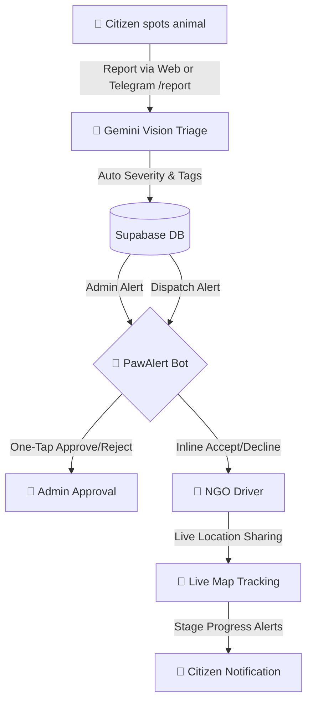

# 🐾 PawAlert — India's 911 for Stray Animals

> **India's first AI-powered stray animal rescue coordination platform.**  
> Report an injured animal in 60 seconds, assess injuries instantly with Gemini Vision, and coordinate rescues via a real-time Telegram Bot companion connected directly to a Supabase backend.

---

## 📈 The Problem & Solution

India is home to **over 20 million stray animals**. When citizens encounter an injured street dog, cat, cow, or bird, they face delayed responses, fragmented communication, and lack of tracking. 

**PawAlert** bridges this gap. It is a production-ready Next.js application that integrates:
1. **Google Gemini Vision AI** to triage injury severity and suggest medical details automatically.
2. **Supabase (Postgres & RLS)** to orchestrate user management, profiles, rescue tickets, and fleet logistics.
3. **Mappls (MapmyIndia)** to render dynamic tracking maps, routes, and live location updates.
4. **Grammy Bot (`@PawAlertBot`)** to enable friction-free coordination, instant admin/NGO approvals, dispatch alerts, and live-location tracking directly inside Telegram.

---

## 🚀 Key Features & Bot Interactions



### 1. Unified Web & PWA Portal
- **Zero-Install Reporting**: Citizens can submit tickets at `/report` with geo-location and injury photos.
- **Live Dispatch Map**: Dynamic real-time vehicle movement visualizers powered by Mappls at `/track`.
- **NGO & Admin Dashboard**: Interactive hubs for coordinating fleets and verifying registrations.

### 2. Multi-Role Telegram Bot (`@PawAlertBot`)
The bot provides role-based access control (RBAC) dynamically linked to your Supabase profiles:
- **👤 Citizens / Reporters**:
  - `/report`: Multi-stage interactive reporting directly from Telegram. Prompts for Photo 📸 → Species select → Live GPS Location Share 📍. 
  - `/status`: Instantly retrieves a beautifully formatted **Rescue Status Card** using a Rescue ID.
- **🚐 NGO Coordinators & Drivers**:
  - **Dynamic Fleet Dispatch**: Drivers get direct notifications on Telegram with inline **✅ Accept** or **❌ Decline** buttons. 
  - **Live GPS updates**: Drivers share their live Telegram location which automatically posts back to the Supabase database. If location updates are stale for over **2 minutes**, the bot automatically alerts the driver to reshare.
  - **Stage Controller**: Easy status-progression buttons inside the driver chat (**Dispatched → Arrived → Rescued**) update the database and instantly message the reporting citizen with live progress updates.
- **🔐 Admins**:
  - **One-Tap Verifications**: When a new NGO applies, the system sends an immediate alert to Admins on Telegram with inline **✅ Approve** and **❌ Reject** buttons. If rejected, the admin is prompted to supply a reason, which is automatically saved to the database.

---

## 🛠️ Tech Stack & Services

- **Frontend**: Next.js 16 (App Router), TypeScript, Tailwind CSS, shadcn/ui, Framer Motion
- **Backend & Database**: Supabase (PostgreSQL, Storage, RBAC Policies, Service Role Admin Client)
- **AI Triage**: Google Gemini 1.5 Flash (via `@google/generative-ai`)
- **Geospatial & Maps**: Mappls Web SDK, Mappls Geocoding & Route API
- **Telegram Engine**: grammY Framework (implemented via serverless API routes `/api/telegram`)
- **Uptime Monitoring**: `/api/health` Keep-alive endpoint for Render free tier sleep mitigation.

---

## 🗄️ Supabase Schema & Database Migrations

Run these SQL scripts in your **Supabase SQL Editor** to establish the core schemas, RBAC configurations, and bucket policies:

### 1. Core Architecture Setup (`profiles`, `reports`, `ngos`, `animals`)
```sql
-- Profiles Table with Role-Based Access Control
CREATE TABLE IF NOT EXISTS public.profiles (
  id UUID PRIMARY KEY REFERENCES auth.users ON DELETE CASCADE,
  email TEXT NOT NULL,
  role TEXT NOT NULL DEFAULT 'ngo',
  ngo_status TEXT DEFAULT 'Pending',
  telegram_chat_id BIGINT UNIQUE,
  created_at TIMESTAMPTZ DEFAULT NOW(),
  CONSTRAINT valid_role CHECK (role IN ('admin', 'ngo', 'citizen'))
);

-- Rescue Tickets (Reports) submitted by Citizens
CREATE TABLE IF NOT EXISTS public.reports (
  id TEXT PRIMARY KEY,
  species TEXT NOT NULL,
  description TEXT,
  lat DECIMAL,
  lng DECIMAL,
  location TEXT,
  severity INTEGER,
  severity_label TEXT,
  status TEXT DEFAULT 'pending',
  image_url TEXT,
  ai_description TEXT,
  injury_tags TEXT[],
  reporter_chat_id BIGINT,
  source TEXT DEFAULT 'web',
  assigned_ngo_id UUID REFERENCES public.profiles(id),
  van_lat DECIMAL,
  van_lng DECIMAL,
  last_location_update TIMESTAMPTZ,
  created_at TIMESTAMPTZ DEFAULT NOW()
);

-- Shelter Animal Profile Directory
CREATE TABLE IF NOT EXISTS public.animals (
  id TEXT PRIMARY KEY,
  name TEXT,
  species TEXT,
  breed TEXT,
  age TEXT,
  gender TEXT,
  status TEXT DEFAULT 'RESCUED',
  rescue_date TEXT,
  location TEXT,
  shelter TEXT,
  image_emoji TEXT
);

-- NGO Registration Queue
CREATE TABLE IF NOT EXISTS public.ngos (
  id SERIAL PRIMARY KEY,
  name TEXT NOT NULL,
  city TEXT,
  applied_on TEXT,
  documents TEXT,
  documents_ok BOOLEAN DEFAULT true,
  status TEXT DEFAULT 'Pending'
);
```

### 2. Enable RLS and Configure Policies
```sql
-- Enable Row Level Security
ALTER TABLE public.profiles ENABLE ROW LEVEL SECURITY;
ALTER TABLE public.reports ENABLE ROW LEVEL SECURITY;
ALTER TABLE public.animals ENABLE ROW LEVEL SECURITY;
ALTER TABLE public.ngos ENABLE ROW LEVEL SECURITY;

-- Profiles Policies
CREATE POLICY "Public profiles are viewable by everyone" ON public.profiles FOR SELECT USING (true);
CREATE POLICY "Users can insert their own profile" ON public.profiles FOR INSERT WITH CHECK (auth.uid() = id);
CREATE POLICY "Users can update own profile" ON public.profiles FOR UPDATE USING (auth.uid() = id);

-- Reports Policies
CREATE POLICY "Public read reports" ON public.reports FOR SELECT USING (true);
CREATE POLICY "Public insert reports" ON public.reports FOR INSERT WITH CHECK (true);

-- Animals Policies
CREATE POLICY "Public read animals" ON public.animals FOR SELECT USING (true);

-- NGO Registration Policies
CREATE POLICY "Public read ngos" ON public.ngos FOR SELECT USING (true);
CREATE POLICY "Service role full access" ON public.ngos FOR ALL USING (true);
```

### 3. Create Storage Buckets for Injury Photos
```sql
INSERT INTO storage.buckets (id, name, public)
VALUES ('animal-photos', 'animal-photos', true)
ON CONFLICT (id) DO NOTHING;

-- Storage upload policy
CREATE POLICY "Public Upload" ON storage.objects FOR INSERT WITH CHECK (bucket_id = 'animal-photos');
CREATE POLICY "Public View" ON storage.objects FOR SELECT USING (bucket_id = 'animal-photos');
```

---

## ⚙️ Local Configuration & Environment

Create a `.env.local` file at the root of the project:

```env
# Supabase Database Configuration
NEXT_PUBLIC_SUPABASE_URL=https://ccjcdjyiparrfzfpwinh.supabase.co
NEXT_PUBLIC_SUPABASE_ANON_KEY=your_supabase_anon_key
SUPABASE_SERVICE_ROLE_KEY=your_supabase_service_role_key

# Google Gemini API
GEMINI_API_KEY=AIzaSy...

# Mappls Maps Integration
NEXT_PUBLIC_MAPPLS_KEY=zatl...

# Telegram Bot Configurations
TELEGRAM_BOT_TOKEN=8868395100:AAHycQMyChTt20sY6_LT7pzyv_cNoaaORww
TELEGRAM_WEBHOOK_SECRET=paw-alert-secret-2025
NEXT_PUBLIC_APP_URL=https://paw-alert.onrender.com
```

---

## 💻 How to Run & Test

### 1. Direct Local Start
```bash
# Install dependencies
npm install

# Run the development server
npm run dev
```

### 2. Test the Telegram Bot locally (Using `ngrok`)
Telegram webhooks require a secure public HTTPS endpoint. To mock this locally:

1. **Start Next.js dev server** (running on port `3000`):
   ```bash
   npm run dev
   ```
2. **Launch ngrok tunnel** (in a separate terminal):
   ```bash
   npx ngrok http 3000
   ```
3. **Register your local tunnel URL with Telegram**:
   Copy the `https://xxxx.ngrok.app` URL forwarding address given by ngrok, and call this API URL in your web browser:
   ```http
   https://api.telegram.org/bot8868395100:AAHycQMyChTt20sY6_LT7pzyv_cNoaaORww/setWebhook?url=https://YOUR_NGROK_FORWARDING_URL/api/telegram&secret_token=paw-alert-secret-2025
   ```
4. **Trigger Commands**:
   Send `/start` or `/report` to the bot on Telegram and check your Next.js terminal logs to view incoming payloads in real time.
5. **Restore production webhook when finished**:
   ```http
   https://api.telegram.org/bot8868395100:AAHycQMyChTt20sY6_LT7pzyv_cNoaaORww/setWebhook?url=https://paw-alert.onrender.com/api/telegram&secret_token=paw-alert-secret-2025
   ```

### 3. Production Deployment & Keep-Alive
- **Deployment**: Deploy the Next.js bundle to Render, Vercel, or Railway. Ensure all environment variables are properly mirrored.
- **Keeping Render active**: Free tiers on Render sleep after 15 minutes of inactivity. Set up a free monitoring check on **UptimeRobot** targeting the public health endpoint:
  ```http
  https://paw-alert.onrender.com/api/health
  ```
  Configure this monitoring check to ping the endpoint every **5 minutes** to ensure instant webhook responses from your bot.

---

## 🤖 Registered BotFather Commands

Configure your bot command registry via Telegram's **@BotFather** (`/setcommands`) using this clean layout:
```text
start - Link your account to your profile
report - Report an injured stray animal 📸
status - Check active rescue ticket status 🔍
myrescues - View driver missions assigned today van - Check driver van dispatch coordinates
help - Display all available commands
```

---

